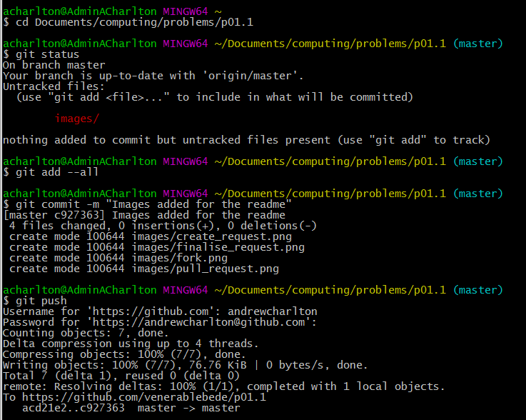
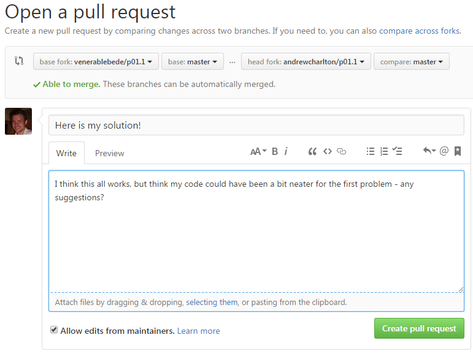

# Problems

This problem set contains two files that you need to make amendments to:

[ ] six_or_bust.py

[ ] bobs_change.py 

# Using Git & Github

This first problem set is designed to introduce you to the wonders
of using git and github. Git is an example of what we call version
control software and is something everyone should have in their life!
No more saving things as version1, version2 etc. and no more emailing
files back and forward.  Rejoice, the future is here!

Here's how to work it...

## Step 1: Github

We will be using the Github website to host our code. A *repository* on
github is a collection of files/folders such as this one (p01.1).

Before we can do anything with our code, we need to create our own copy:
  * Log in to github.
  * Navigate to the problem set you want.
  * Click the fork button

  

  * Make a note of the URL - you'll need it for the next step.

## Step 2: The git command prompt.

  * Open up git bash - a command prompt should appear.
  * Navigate to where you want to download the problems to (you don't need to create a new folder, this will happen automatically.)  Some useful commands are:
    -  **cd folder** : Change directory to the specified folder.
    -  **cd ..** : Change to the parent directory.
    -  **ls** : Lists the contents of the current directory.

  * *Clone* the files from github using the command:
        `git clone https://github.com/username/reponame/ `
    This will download all of your files from github.

## Step 3: Fix the problems.

  * Open up each of the .py files in the folder.  Read the descriptions
    of what each function should do, and write the code to make it happen.

  * To check your code works, run it and call *run_tests()*.  This will automatically
    check to see if it does what it should.

## Step 4: Create a commit (a snapshot of our work) on git.

  * Open up git bash.
  * **cd** to the folder your problems are in.
  * **git status** will show you what files have been changed.
  * **git add filename** will add any changes to that file, to our snapshot.
  * **git add --all** will add all the changes we've made, to our snapshot.
  * **git commit -m "*message*" ** will create our snapshot, with a message to
    describe the changes we've made.  Don't forget the message!
  * **git push** will upload our changes to github.  Enter your username and password
    if it prompts you to.

Here's a screen-shot of me committing the images needed for this guide.

## Step 5: Submitting your work.

  * Go back to the github website and navigate to your repository.
  * Click the 'New pull request' button
    
  * Click the 'Create Pull Request' button:
    
  * Give your submission a title and add any comments you have about it, and then click 'Create Pull Request' again.
    

 
## All done!

Your work is now submitted - you should receive notifications on github when your work
has been looked at, and if there are any comments on how you could improve/fix it.
  
